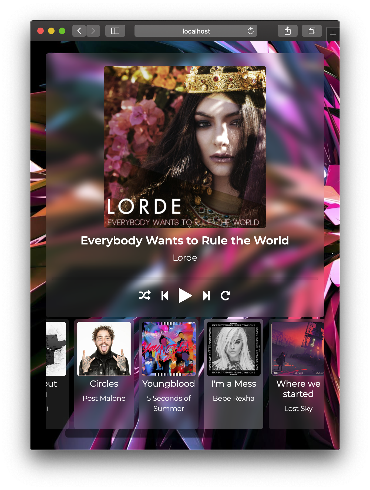

# OnlineMusicPlayer
A Dumi Online Music Player with basic controls like Shuffle and Play Loop.

## Installation Guide

1. Clone the repository:
```git clone https://github.com/Sourav-98/OnlineMusicPlayer-Shufflr.git```
2. Install all the required node modules:
```npm install```
   > This will install dependencies for ExpressJS.
3. Start the Express server:
```npm start```
4. Open your browser and go to `http://localhst:8080` to view the application
	> Note: Music playback will take time, so be patient.

## Screenshots - Desktop and Mobile View



